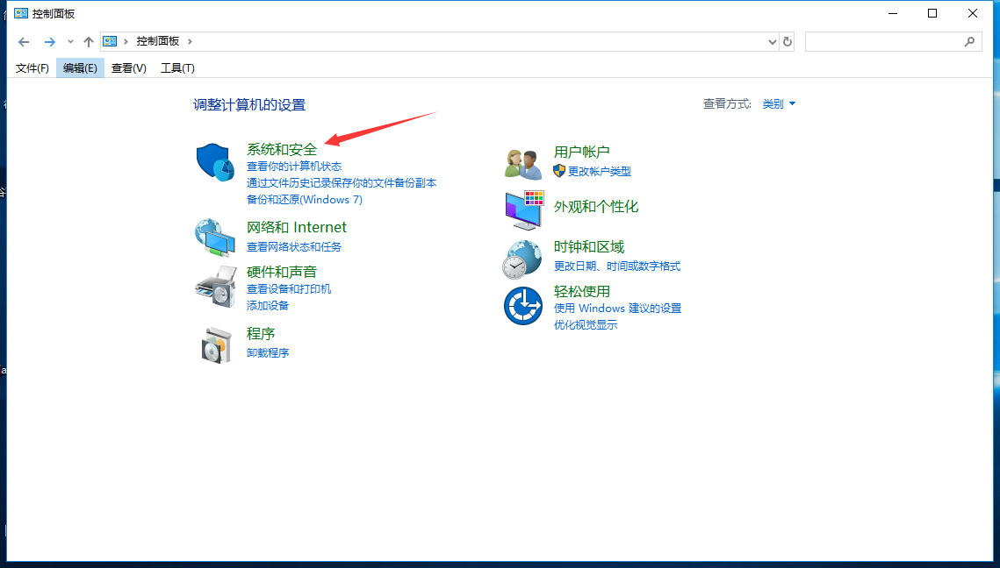
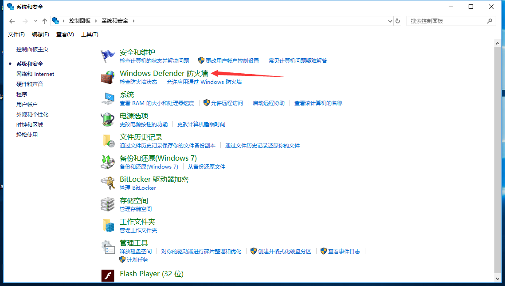
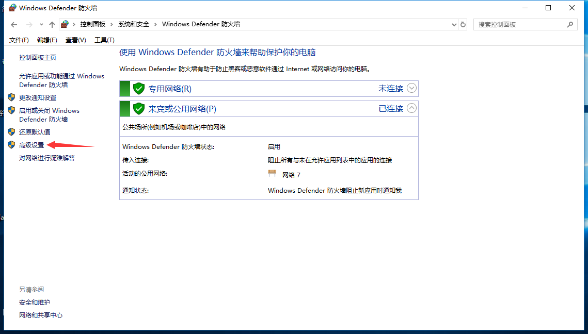
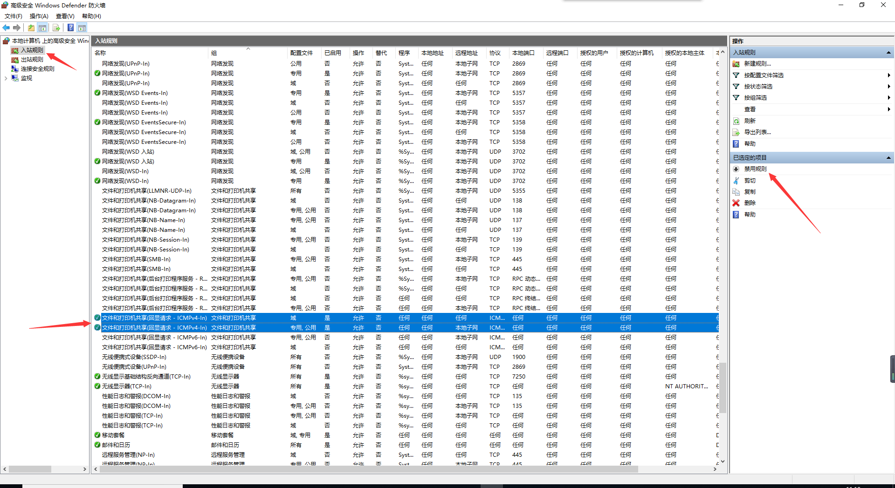
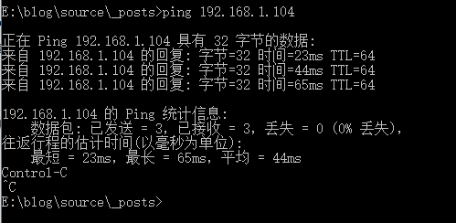

<h3>注意：</h3>

**这不是虚拟机上的linux和win10互访，虚拟机上的linux系统ping不通win10，绝大数情况下改为桥接模式即可ping通。**

------

物理机下的linux系统和win10互ping,先要保证在同一个局域网下，linux系统可以有线连接，也可以无线连接，若linux可以访问到百度之类的网址，而且win10可以ping通linux主机，但是linux却ping不通win10主机，多数情况下因为win10主机的防火墙影响导致，可以选择关闭防火墙或者启用入站规则,但是关闭防火墙又有可能带来其他风险，不建议关闭。

首先打开控制面板-系统安全

选择防火墙-高级设置

选择入站规则-文件和打印机共享（ICMPv4）ICMPv4都选，点击右边的启用规则（我这边以及启用了，所以显示禁用规则）

最后在ping一下linux主机，就能ping通了，这样就可以避免因关闭防火墙而带来其他危险。

